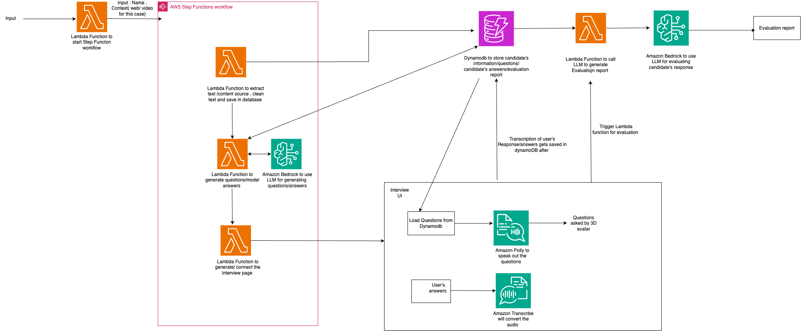

# Jobreadiness Mock Interview Prototype 

The job readiness portal with a virtual AI interviewer is designed to serve college students, recent graduates, and career changers entering the job market. It caters to individuals actively seeking employment, as well as those undergoing professional transitions. Additionally, educational institutions, corporate training programs, and job placement agencies can benefit from integrating this platform to enhance their students' or clients' interview preparation. The portal is also valuable for self-learners and skill builders keen on improving their interview and communication capabilities. With a focus on personalized, topic-specific interview questions, the platform provides a versatile solution for a diverse audience at various stages of their professional development. So after a user reads a topic he can take a 10 mins mock interview of that topic and get his evaluation.

## Architecture



## Prerequisites

For this walkthrough, you need to have the following prerequisites:

- An [AWS account](https://portal.aws.amazon.com/billing/signup)
- [AWS SAM CLI](https://docs.aws.amazon.com/serverless-application-model/latest/developerguide/serverless-sam-cli-install.html) installed and set up with [credentials](https://docs.aws.amazon.com/serverless-application-model/latest/developerguide/serverless-getting-started-set-up-credentials.html)
- Python 3.12 Installed and in your PATH variable
- Bedrock model access

In order to setup this demo to be runnable you will need to set up a few things in your AWS account. The steps below will guide you through creating a Cognito Identity Pool that allows the demo applications to talk to AWS services—Amazon Polly, Amazon Transcribe, Amazon Bedrock, Amazon DynamoDB. Please follow the steps below :

## Infrastucture Setup

Go to "cloud-infra-setup" folder . 

eg: cd root-folder-name/cloud-infra-setup

run...

```
sam build && sam deploy --guided
```
Once your deployment is complete  go to Cloudformation we see see a stack has been created. In the output section 

## App Credentials Setup
In order to allow our front-end application to make API calls to aws services used we must create authorization credentials that it can use.

In the AWS console, navigate to the Cognito service.

Confirm that the Cognito console is set to your desired AWS region. (Example, "us-east-1")

Click Manage Identity Pools.

1. For Configure identity pool trust: select Guest access
2. Configure permissions: select create a new IAM role , and give a name.
3. Configure properties: just provide a name for identity pool (remaining default)
4. Review and create identity pool.
5. Now go to your identity pool , select user access -->Guest access --> select Guest role .
6. you will be routed to IAM console,will be presented with a page informing you that some IAM roles will be created on your behalf.

In Permissions policies:

Select Add permissions > Attach policies.

In the search box, search for "AmazonBedrockFullAccess". Tick the checkbox next to that policy to select it. This policy will allow our application to access Amazon Bedrock.

In the search box, search for "AmazonDynamoDBFullAccess". Tick the checkbox next to that policy to select it. This policy will allow our application to access Amazon DynamoDB.

In the search box, search for "AmazonPollyFullAccess". Tick the checkbox next to that policy to select it. This policy will allow our application to access Amazon Polly.

In the search box, search for "AWSLambda_FullAccess". Tick the checkbox next to that policy to select it. This policy will allow our application to access AWS Lambda.

In the search box, search for "AmazonTranscribeFullAccess". Tick the checkbox next to that policy to select it. This policy will allow our application to access AWS Lambda.


Now that you've selected the permissions policies required by our application, click the Attach policies button.

In the resulting screen, confirm that all polices have been added to the list of permissions policies for the role.

Now we will create a cognito user pool, follow the below steps 

1. Navigate to the AWS Management Console and locate AWS Cognito.
2. In Cognito, go to User Pools and select "Create User Pool".
3. Configure the sign-in experience by choosing your preferred sign-in options.
4. Configure security credentials according to your preferences.( No MFA for the demo)
5. Customize the signup experience by selecting attributes,  keep the defaults for the demo.
6. For message delivery, choose Cognito to send emails.
7. Integration with your app is crucial. Enter a unique user pool name and check the "Use Cognito Hosted UI" option.
8. Set up a Cognito domain, selecting a name that will serve as the endpoint for user login, signup, and authentication.
9. Add your app client, with the callback URL as the CloudFront URL obtained from the CloudFormation template eg: https://CLOUDFRONT-DOMAIN-NAME/jobreadiness.html.
10. Choose the appropriate app type for your authentication flow; we'll be using, a public client with disabled client secret generation should suffice.
11. Review the settings and create the user pool

Your app credentials setup is now complete! 🎉

(** go to Hosted UI in the user pool and click view Hosted UI.You will be routed to a webpage usking you to log in , copy the url to any text editor . this url will be your value for "LOGIN_LINK" in src/demo-credentials.js.Similarly click sign in , copy the url ,this url will be your value for "SIGNUP_LINK" in src/demo-credentials.js)

## Environment Setup


In a terminal on your local machine, navigate to the repository root directory and run...

```
npm install
```

## Configuring Demo Credentials

In order for the demos to leverage the Cognito credentials you set up in the **App App Credentials Setup** section you'll need to make the following edit...

Open the `src/demo-credentials.js` file editing.

Set the `cognitoIdentityPoolId` value to the Cognito Identity Pool you previously created. 

Save the edits you made to the `demo-credentials.js` file.

Your sample code credential setup is now complete! 🎉


## For Local setup 


In a terminal on your local machine, navigate to the repository root directory and run...

```
npm run start 
```

(** make sure you change the redirect urls login and signin links in cognito user pool as well in the demo-credentials.js file , to redirect to the localhost url)


## Deploying the Demos to a Web Server

To deploy the demos to a web server so that others can access them follow the steps below.

Run the following command which will build a deployable version of the web application.

```
npm run build
```

The command above outputs the deployable files to a "dist" folder. Deploy all the files inside the "dist" folder to your web server.

For  this demo , upload all the files of 'dist' folder to the s3 bucket that has been created in the Infrastucture Setup ( You can find the S3 bucket in cloudformation output section)

You can access  your application now from the Cloudfront Distribution (You can find the S3 bucket in cloudformation output section)

> ⚠️ **Important:** This demo requires access to the user's microphone for voice input. Browsers will only allow microphone access for websites hosted securely with SSL (over https://). Be sure your web server is configued to use SSL..

> 💡**Tip:** If you want an easy solution for hosting these demos, [AWS Amplify](https://aws.amazon.com/amplify) provides a simple drag-and-drop interface for hosting static web applications.

Congratulations! The demos are now accessible to anyone who can access that web server. 🎉


## License

This library is licensed under Amazon software License. See the [LICENSE](LICENSE) file.

